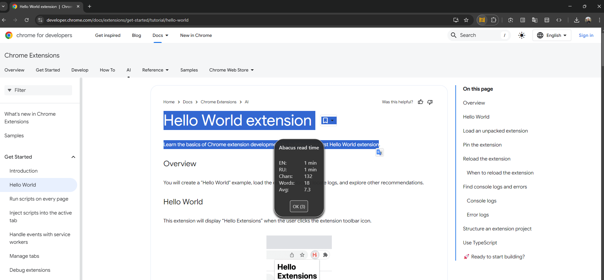

# Abacus - reading time
Chrome extension - approximates reading time by counting words on the page. 

- by default - counts all content on a page. 
- If only some text selected when called  - counts only selected

Written with chatGPT

## Setup:
1. Go to `chrome://extensions/`
2. Enable `"Developer mode"` (top right corner).
3. Click `"Load unpacked"` and select `abacus_reading_time/` folder
4. Go to any page, click the extension icon — you'll get aler popup mesage with the read time, plus word and character count

#### Optional:
5. Add shortcut - go to `chrome://extensions/shortcuts` click `edit` button on `Activate the extension`. Set desirable shortcut e.g. `control+shift+W`
6. Change reading speed variable. In [./content.js](./content.js) change `WORDS_PER_MINUTE: {EN: 200}` value according to ur reading speed. 
   - if dont need second language. comment out | delete `'RU'` line lower in the `'alert'` block. 


## File structure:

```
abacus_reading_time/
|-- background.js
|-- content.js
|-- example_1_full_page.png
|-- example_2_only_selected.png
|-- icon.png
|-- LICENSE
|-- manifest.json
|-- README.md

```


## inspired by
[Steven-Roberts/Word-Counter-Plus](https://github.com/Steven-Roberts/Word-Counter-Plus)
since Chrome says it'll soon delete the extension. 

## Example screenshots

#### full page text content - including footers and other junk


#### only selected text



